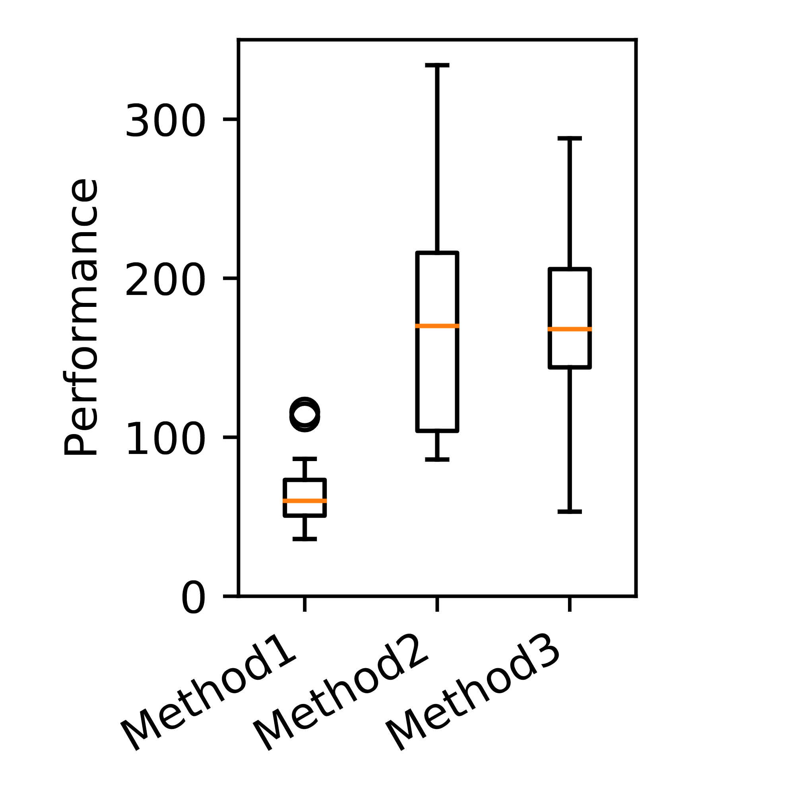

# vis_tool
Python scripts to visualize exeprimental results for image computing researches

# Functions:
1, Visualize a segmentation result compared with the ground truth. 
```bash 
python show_segmentation_contour.py
```


In this example, the ground truth is shown in yellow color and the segmentation is shown with green color.


2, Use boxplot to compare the performance of different methods on a set of data.
```bash 
python show_boxplot.py
```

