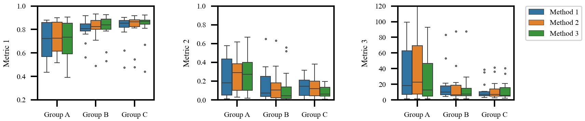
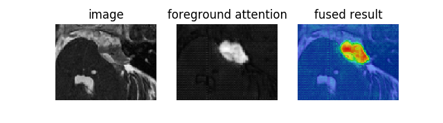
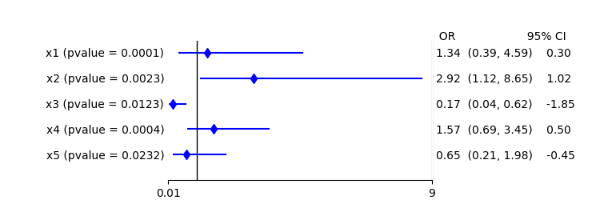

# vis_tool
Python scripts to visualize exeprimental results for image computing researches

# Functions:
1, Visualize a segmentation result compared with the ground truth. 
```bash 
python show_segmentation_contour.py
```


In this example, the ground truth is shown in yellow color and the segmentation is shown with green color.


2, Use boxplot to compare the performance of different methods on a set of data.
```bash 
python show_boxplot.py
```


3, Use seaborn to show boxplot.
```bash
python show_boxplot_seaborn.py
```


4, Fuse a heatmap with an image
```bash 
python show_fused_heatmap.py
```


5, Show forest plot of logitic regression
```
python show_forest_plot.py
```
